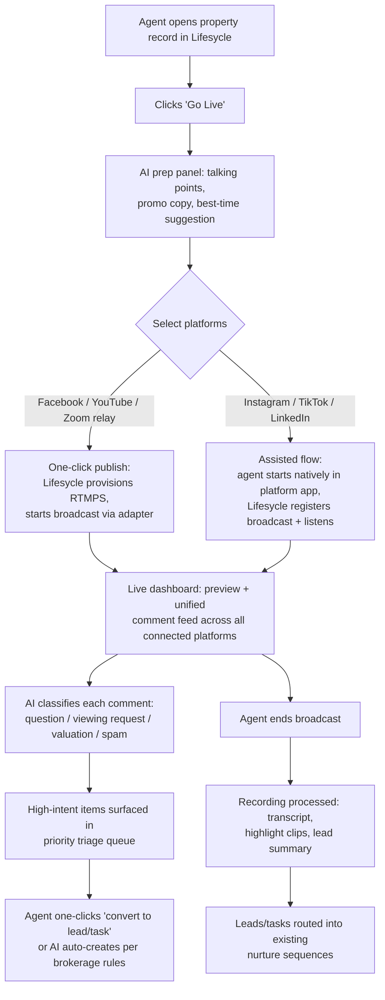
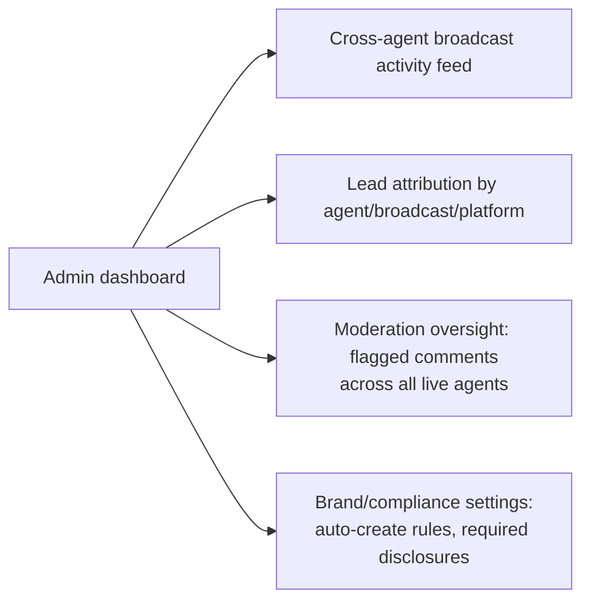
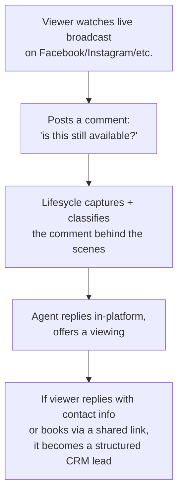

# 08 — User Journeys

Full lifecycle journeys covering the three user types identified in [01-product-discovery.md](01-product-discovery.md): the agent, the brokerage admin, and the viewer/buyer. Diagrams use Mermaid.

> **2026-09 update — reconciled with the actual build.** Sections 1–6 below are the original Phase 2 journeys and are kept as-is; they remain the right *shape*. Section 7 ("Detailed lifecycle journey, as-built") replaces the "edge-case journeys (to design in detail during build)" placeholder at the bottom of this doc with real, step-by-step journeys grounded in the current code (`server/src/routes/broadcasts.ts`, `services/ingestionService.ts`, `routes/engagement.ts`, `routes/leadCapture.ts`, `app/src/features/live/`) and in `PROGRESS.md`. Where the original journey text described something not yet true of the running system, that's flagged inline rather than silently corrected, per this repo's "honest scaffold" rule against fabricating a working flow.

## 1. Core lifecycle: agent going live (one-click platform, e.g. Facebook/YouTube)

## 2. Pre-live journey (detail)

1. Agent selects a property record already in Lifesycle (no separate "create broadcast" step — broadcasts are always attached to a property).
2. AI prep panel (see [10-ai-features.md](10-ai-features.md)) suggests: 3–5 talking points drawn from the listing data, a short promo caption per platform, and — based on historical engagement data for that agent/area — a suggested time to go live.
3. Agent chooses platforms. UI must show the [04-technical-feasibility.md](04-technical-feasibility.md) distinction plainly: a "Go Live Now" button for one-click platforms, and a "Start on Instagram/TikTok, then link it here" instruction step for assisted platforms — never implying a false single action across all six.
4. LinkedIn specifically forces a scheduling step (per the June 2026 mandatory-advance-scheduling rule) — the UI should not offer an "instant" LinkedIn option at all.

## 3. Live journey (detail)

- Comments arrive at different latencies depending on the underlying mechanism (Facebook webhook = near-instant; YouTube/Zoom = short poll interval; Instagram/TikTok = not available live at all, see [05-api-research.md](05-api-research.md)) — the UI should indicate per-platform feed freshness rather than implying uniform real-time coverage.
- Every comment is normalized into the `EngagementEvent` schema from [06-system-architecture.md](06-system-architecture.md) and classified by AI. Three outcomes: auto-created lead/task (high confidence + brokerage auto-create enabled), suggested action awaiting one-click agent confirmation (medium confidence), or filtered out silently (spam/small talk).
- Moderation actions (hide/flag) follow the platform-capability matrix from [05](05-api-research.md) — hiding a comment pushes back to the source platform only where the adapter supports it; otherwise it's hidden in Lifesycle's view only, and the UI discloses this.

## 4. Post-live journey (detail)

1. Recording (captured once centrally regardless of platform mix, per the architecture's shared media relay) is processed: transcript generated, highlight clips cut, a lead/engagement summary compiled.
2. Every CRM record created during the broadcast retains its source platform + broadcast ID (feeds [16-success-metrics.md](16-success-metrics.md) attribution).
3. Leads flow into Lifesycle's existing nurture/sequence engine per rules defined in [09-crm-integration.md](09-crm-integration.md).
4. Agent receives a post-broadcast summary: viewer count (where available), leads generated, top comments, suggested next actions.

## 5. Brokerage admin journey

Admin does not typically watch broadcasts live — the value is aggregated visibility (who's going live, how many leads each produces) plus the ability to set brokerage-wide policy (e.g., require manual lead confirmation rather than AI auto-create, enforce a recording-consent disclosure).

## 6. Viewer/buyer journey

The viewer never leaves the platform they're already on and never logs into Lifesycle — this is a deliberate constraint, not a gap:

## Edge-case journeys (to design in detail during build)

- **Degraded-capability platform mid-broadcast**: e.g., an Instagram Live the agent started natively, where Lifesycle can only pull comments after the fact — the live dashboard must clearly show "comment capture available after this stream ends" rather than an empty live feed that looks broken.
- **Moderation escalation**: an offensive comment appears on a platform with no push-back moderation API (e.g., TikTok) — Lifesycle can only hide it locally; the agent needs a clear prompt to also moderate manually within the native platform app.
- **Mid-broadcast technical failure**: RTMPS relay outage — agent needs an immediate, clear failure state and a manual fallback (e.g., "continue directly in Facebook's own app") rather than a silent drop.
